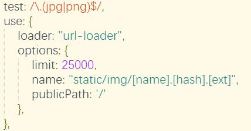

# service-worker.js


在进行生产环境下调试出现上面错误是因为
没有使用配置时候的域名进行浏览的，而是使用了其他的比如 `http://localhost:8080/`这样的
改成配置域名即可
>这个是用来做离线缓存的新的api实现。其工作原理是缓存同源路径下的请求，相当于是在前端与后端数据中加了一个缓存层，使得在离线状态下也能够正常访问部分页面。
# 解决关于复杂图片路径问题
> 我觉得，会出现各种图片路径原因很大的方面是由于使用了相对路径的原因
> 我的解决思路是使用绝对路径，就可以避免了



上图就是使用绝对路径的一种方法
```
test: /\.(jpg|png)$/,
use: {
    loader: "url-loader",
    options: {
        limit: 25000,
        //name 表示将会生成的图片的路径，同样也是替换路径
        name: "static/img/[name].[hash].[ext]",
        //publicPath 表示在生成的路径前面需要添加的全局路径 
        publicPath: '/'
    },
}
```
同样因为我们页面就是在根目录下面的，所以说，生成路径与全局路劲可以写在一起

生成路径为   服务器地址/static/img/[name].[hash].[ext]
```
test: /\.(jpg|png)$/,
use: {
    loader: "url-loader",
    options: {
        limit: 25000,
        //name 表示将会生成的图片的路径，同样也是替换路径
        name: "/static/img/[name].[hash].[ext]",
    },
}
```
但是正常情况下，我们的服务器路径是复杂的，这个时候就需要publicPath了

例如：图片路径为    服务器地址/pc
```
test: /\.(jpg|png)$/,
use: {
    loader: "url-loader",
    options: {
        limit: 25000,
        name: "static/img/[name].[hash].[ext]",
        publicPath:'/pc'
    },
}
```
>注意：这里name前面不需要加‘/’了，因为publicPath会自动向后面添加一个‘/’
生成路径为   服务器地址/pc/static/img/[name].[hash].[ext]
