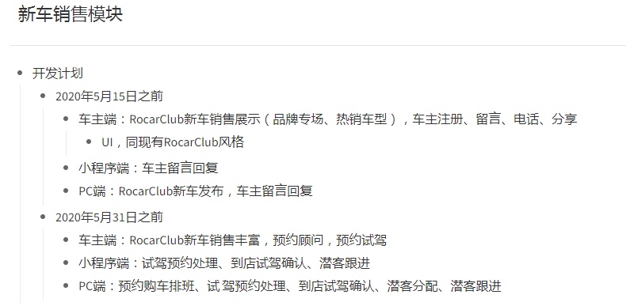

# 2020年1月15日 
## 后台设计案例的配色与布局效果，应用于系统
1. [PC中台界面设计案例](https://axhub.im/pro/7cd0482cb7ff9d8f )
2. [PC中台系统设置设计案例](https://axhub.im/pro/2e5a0ad573ac19bc/)
3. [PC端系统架构搭建案例](http://k7i9ot.axshare.cn)

# pc 端的
- [ ] websocket相关问题
- [ ] 黄箭头
- [ ] 报表：显示、导出PDF（frx后缀）、支持js编程（菜单定义增加js编辑器）
- [ ] 打印：fastreport输出PDFvs
- [ ] 车主消息：穿透到业务单据，如预约、救援。
- [ ] 系统消息：已读、未读、穿透到业务单据，如新的审批，卡券发放
- [ ] 审批相关：审批模板、审批平台、审批流程图
- [ ] 帮助页面

## 优化
- [x] 全屏 
- [ ] *号必填占位
- [x] 截图的这一列看怎么封装下变成，鼠标移上去之后显示“编号：xx”这样的Tooltip ，也就是把真实的Id显示出来，所有panel均采用这种展示方式。

- [ ] 事件消息功能更新到新版方法

# 2020年4月15日
[试驾预约及推荐开发设计](https://mubu.com/doc/GAEDnPdEkG)
[签到开发设计](https://mubu.com/doc/7r-CT_tg5AG)

## 公众号更新功能
- [ ] 试驾预约

## 小程序
- [ ] 工作提醒中增加： 试驾预约提醒，单据处理
- [ ] 预约单修改部分文件

# 签到BUG
1. IsExistSign字段每次都是true
2. 连续签到没有新增

## 原版PC
- [ ] 试驾车型表
- [ ] 推荐规则
- [ ] 客户平台期间统计表需要一个缓存机制
筛选的时候做下优化：
前提：主要条件不变的情况下。如日期、公司，可以用hash验证比较方便。
第一种情况：比如第一次查询选择了A、B、C、D、E、F这些列
，如果第二次查询主要条件日期、公司不变，但是选择了A、B、C或A、D、E，那么此时不需要调用接口，直接隐藏该列即可。
第二种情况：如果第二次查询主要条件日期、公司不变，且多选了一列G，那么此时接口仅仅需要调用G列的查询即可。

## 新版PC
[系统主题风格设计](https://mubu.com/doc/WH2WFCbsQG)

# 新车试驾功能

# 2020年5月14日
1. 商品实体使用的全部地址 和 电话 收件人 名称 使用微信自带的地址栏
- 2. 卡券规则领用总数 最大值不可以超过1000000
- 3. 商城中有店会不添加轮播图， 当不添加轮播图的时候，不能遮挡到返回按钮
- 4. 卡券面值 必须大于0
5. 商城首页 和 自营商城分享的时候  添加 当前的页面名称
6. 商品分页+置顶功能
- 7. 商品订单 添加 核销  退款  和  更新快递信息的权限，退款申请UI重写
- 8. 商品发布自提、邮寄、卡券（自定义表），邮寄控制
- 9. 订单核销：订单核销时如果存在多台车，能选择车辆；

# 新车销售
1. 首付可以为0  0 则为不展示 其他也是如此
2. 手机端留言500字

# 小程序
1. 预约单中  添加接待顾问 这个接口变了 需要调整

