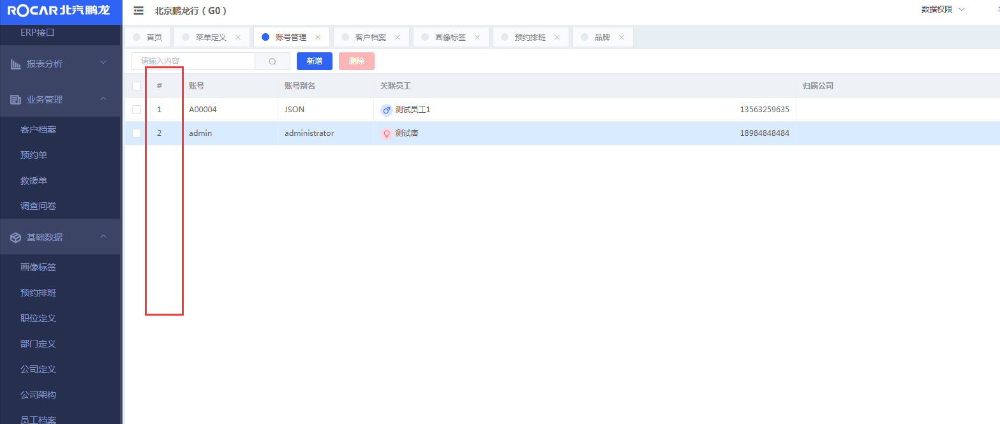
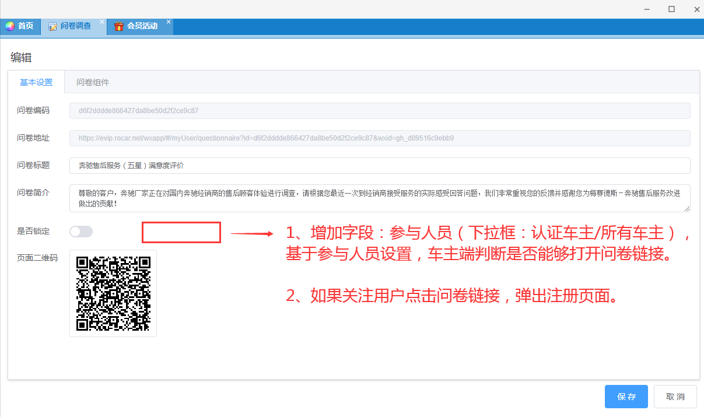
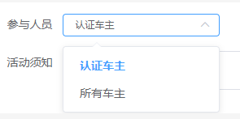

# 2020年1月15日 
## 后台设计案例的配色与布局效果，应用于系统
1. [PC中台界面设计案例](https://axhub.im/pro/7cd0482cb7ff9d8f )
2. [PC中台系统设置设计案例](https://axhub.im/pro/2e5a0ad573ac19bc/)
3. [PC端系统架构搭建案例](http://k7i9ot.axshare.cn)

# 2020年1月16日
## 员工档案于开发者账户记得添加重置密码
## 右上角头像跟部门信息没有更新

# pc 端的
- [ ] websocket相关问题
- [ ] 黄箭头
- [ ] 报表：显示、导出PDF（frx后缀）、支持js编程（菜单定义增加js编辑器）
- [ ] 打印：fastreport输出PDFvs
- [ ] 车主消息：穿透到业务单据，如预约、救援。
- [ ] 系统消息：已读、未读、穿透到业务单据，如新的审批，卡券发放
- [ ] 审批相关：审批模板、审批平台、审批流程图
- [ ] 帮助页面

## 优化
- [x] 全屏 
- [ ] *号必填占位
- [x] 截图的这一列看怎么封装下变成，鼠标移上去之后显示“编号：xx”这样的Tooltip ，也就是把真实的Id显示出来，所有panel均采用这种展示方式。

- [ ] 事件消息功能更新到新版方法

## 老版公众号更新功能
- [x] 提交问卷后，可让客户选择是否打开抽奖界面，点“关闭”按钮，跳转到个人首页，点“抽奖”按钮跳转到抽奖页面，同时把问卷的部分信息带到问卷界面。
- [x] 抽奖界面中若商品为邮寄商品，需要车主填写地址信息，若不是，则无需填写
- [x] 车主在打开问卷消息提醒后，能将提醒链接中部分字段解析（类型，单号），传递到后台。
- [x] 我的预约中，车主能自主设置保养到期提醒日期，保险到期提醒日期。
- [x] 增加日期下拉框组件
- [x] 增加地理位置下拉框组件，省直辖市、市、区/县、街道/乡镇。
- [x] 在所有组件中，增加其他选项，若选择其他，显示单行输入文本框。
- [x] 调查问卷添加两个字段  参与类型（就是参与人员） 与 是否参与抽奖（这个手机端已经实现了）

- [x] 在调查问卷添加一个新的组件叫标签组件，这个组件提交之后，后保存到用户的标签中去
- [x] 续保预约功能对接后台
- [x] 复选框中其他选项展示效果，参考单选框其他选项的效果。即复选框必须选择中“其他”选项，出现单行文本框
- [ ] 添加视频浏览功能 现在公众号中写一个demo

## 小程序
- [ ] 预约功能添加新的数据

