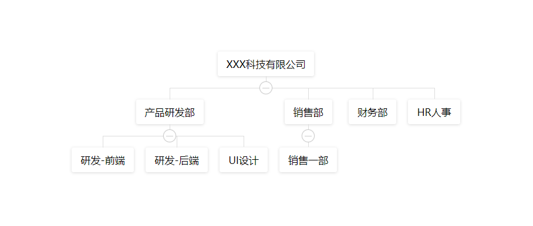
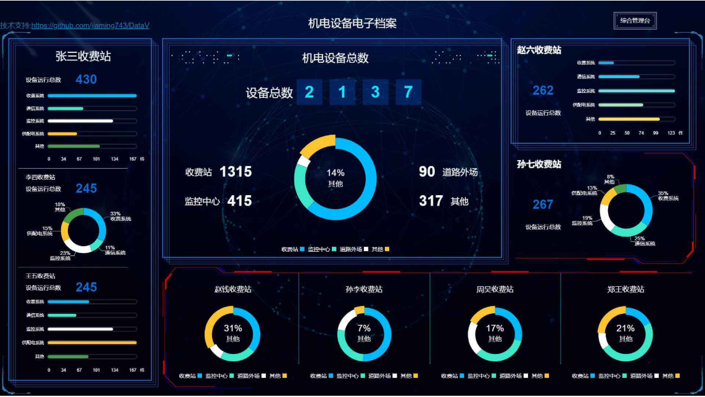
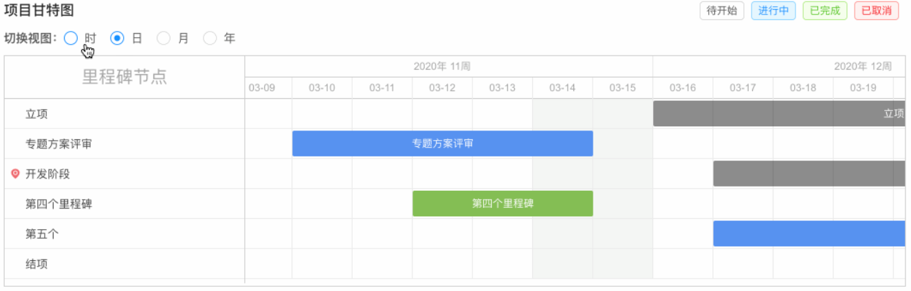
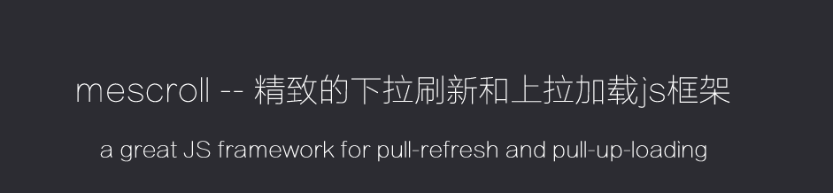

# 轮播图
swiper
>vue 版的可以搜索  vue-awesome-swiper

# css 色彩解决框架（这个我比较喜欢纯粹的css框架，色彩高饱和）
[colorUi](https://github.com/weilanwl/ColorUI)

# 拖动API
sortablejs
> 可以灵活的支持vue 对接element
[拖放排序插件Sortable.js](https://segmentfault.com/a/1190000008209715)
>插件的中文介绍

# vue-transfer-dom.js
> 可以将vue的组件放置到body上
> 现在我是用于阻止弹框滑动时，背景滑动的状态

# 组织架构展示图（v-org-tree）
[v-org-tree](https://github.com/lison16/v-org-tree)

# 富文本编辑器
tinymce

# CSS定制框架
Tailwind 

# 一个用于制作很炫的可视化组件
[DataV](https://github.com/DataV-Team/DataV)

# 甘特图
[艰难用echarts模拟甘特图😭，直到我发现了dhtmlxGantt](https://juejin.im/post/5e7ffd56f265da794e526102)

# 下拉刷新和底部加载
[mescroll.js](http://www.mescroll.com/index.html)

