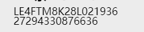
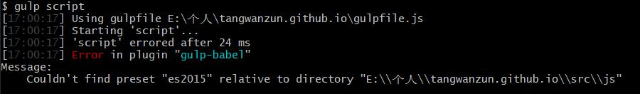

# 2018年10月10日
## node文件打包成跨平台应用
[张鑫旭使用electron构建跨平台Node.js桌面应用经验分享](https://www.zhangxinxu.com/wordpress/2017/05/electron-node-js-desktop-application-experience/)
# 2018年10月11日
## CSS3 clip-path
> 苹果小程序端不支持
可以用来构建各种多边形，采用遮罩方式，
解决了之前制作三角形的需求
[张鑫旭CSS3 clip-path polygon图形构建与动画变换二三事](https://www.zhangxinxu.com/wordpress/2015/03/css3-clip-path-polygon-shape-transition-animation/)
## 用户预加载与懒加载之间进行的平衡
## 关于Promise的感性认知（异步）
说大了，感觉就是对于编写代码时候的感觉
用上帝视角来看程序，和用第一视角看程序
用不用promise对于程序编写没有任何变化只是说，编写程序的思想变了，让多异步操作换了一个思路 

利用promise的时候，我们只关心程序的行走的过程
例如 A->B->C
我们不关心 A失败了之后，结果如何我们只关心从A->B->C这个经历
[张鑫旭 ES6 JavaScript Promise的感性认知](https://www.zhangxinxu.com/wordpress/2014/02/es6-javascript-promise-%E6%84%9F%E6%80%A7%E8%AE%A4%E7%9F%A5/)
# 2018年10月17日
## 纯css内凹圆角
很有意思，感觉，已经在项目中我的二维码实现了
主要是用了径向渐变实现的
[border、outline、boxshadow那些事以及如何做内凹圆](https://segmentfault.com/a/1190000005153660)
## 微信公众号保存div为图片
有时候需要用到这么一个功能，把一个div转成一个图片
这个可以用一个名叫html2canvas的插件
他的作用是把div转成canvas
然后canvas中有个函数是canvas.toDataURL('image/jpeg'),参数是图片类型,我一般用这个，因为这个样子图片相比于png格式的小
这个函数可以把图片转成base64位的，然后把他放到img的src中就可以了
在安卓和苹果端都是可以长按下载的
# 2018年10月24日
## 纯css瀑布流布局
采用了一个之前知道但是从来没有用过的属性 Multi-columns
下面的网页有使用了多种布局方式，但是我还是比较喜欢上面的这种
``` html
<div class="work-list">
	<div class="work-item"></div>
	<div class="work-item"></div>
	<div class="work-item"></div>
	<div class="work-item"></div>
</div>
```
``` css
.work-list{
  column-count:2;		//设置列数
  column-gap: 10px;		//设置列之间的间隔
}
.work-item{
	//实现瀑布流的关键,不分割div，否则就会出现第一列最下面的div被分割到了第二列上面
  break-inside: avoid;	
}
```
[纯CSS实现瀑布流布局](https://www.w3cplus.com/css/pure-css-create-masonry-layout.html)
# 2018年10月25日
## 监听页面是否关闭
这个可以监听到网页是否为可见状态
可见状态为页面位于显示的时候，
不可见状态下为：非次页签，或者手机home键将网页调整到后台，或者直接清空应用程序
用途：可以用在监听客户页面停留时间
``` javascript
document.addEventListener('visibilitychange', function () {
  // 用户离开了当前页面
  if (document.visibilityState === 'hidden') {
    document.title = '页面不可见';
  }

  // 用户打开或回到页面
  if (document.visibilityState === 'visible') {
    document.title = '页面可见';
  }
});
```
[阮一峰 Page Visibility API 教程](http://www.ruanyifeng.com/blog/2018/10/page_visibility_api.html)
# 2018年10月30日
## css绘制三角形
有时候会很实用的功能,就是通过border来设计的
border其实不是矩形，而是一个梯形,如果border足够宽,而且div内容设置成0的时候,三角形就出来了
[css如何将div画成三角形](https://www.cnblogs.com/v-weiwang/p/5057588.html)
# 2018年10月31日
## vue中store数据永久保存
通常情况下store的数据是无法长时间保存的，刷新退出页面都会使store失效
有个现有插件可以解决这个问题,让store数据永久保存
> vuex-persistedstate
``` javascript
// 基本使用使用方法
import createPersistedState from 'vuex-persistedstate'
const store = new Vuex.Store({
    // 定义状态 
    state,
    mutations:,
    //挂载插件用于store的持久保存
    plugins: [createPersistedState({})]
})
```
[](https://www.zhangxinxu.com/wordpress/2015/03/css3-clip-path-polygon-shape-transition-animation/)
# 2018年11月10日
## SVG外联图片转css样式内嵌
这个挺有用的一个js库
[svg-inject](https://github.com/iconfu/svg-inject)
# 2018年11月6日
## 小程序新增了几个API比较有意思
1. 支持在手机上启用屏幕旋转
2. mDNS 局域网通信能力
# 2018年11月13日
## 任务计划
在计算机开始搜索中搜索'任务计划'即可打开任务计划程序
这个程序是用来进行定时,开机,用户进入等行为执行启动一个程序或者一个脚本的
程序自不必说,重点是脚本,这个程序可以启动window的bat脚本
这个脚本是可以运行cmd命令的
他也是有一套自己的语法的
利用这个就可以做到比如说
> 开机自动启动node脚本
## 关于bat启动后页面直接关闭
可以在最后一行加上一个代码
```
pause
```
# 2018年11月14日
## 关于提高CSS动画性能
will-change
> 提前对浏览器声明开始使用动画,让浏览器提前调用GPU
> 常用参数
``` css
/* 关键字值 */
will-change: auto;
will-change: scroll-position;
will-change: contents;
will-change: transform;        /* <custom-ident>示例 */
will-change: opacity;          /* <custom-ident>示例 */
will-change: left, top;        /* 两个<animateable-feature>示例 */
/* 全局值 */
will-change: inherit;
will-change: initial;
will-change: unset;
```
# 2018年11月16日
## css多行与单行省略
多行  这个只适用于webike内核的浏览器
``` css
isplay: -webkit-box; //必须结合的属性 ，将对象作为弹性伸缩盒子模型显示 。
-webkit-box-orient; //必须结合的属性 ，设置或检索伸缩盒对象的子元素的排列方式 。
text-overflow: ellipsis; //可以用来多行文本的情况下，用省略号“…”隐藏超出范围的文本 。
overflow : hidden;
display: -webkit-box;
-webkit-line-clamp: 2;
-webkit-box-orient: vertical;
```
[css实现单行、多行文本溢出显示省略号(…)](http://www.cnblogs.com/mengruying/p/5565042.html)
# 2018年11月26日
##  平滑滚动
> 凡是需要滚动的地方都加一句scroll-behavior:smooth就好了！
这个滚动是采用了锚点定位时候的滚动
在选项卡中,可以使用锚点定位来使选项卡进行切换,这个样子的话可以使切换添加滚动
[CSS scroll-behavior和JS scrollIntoView让页面滚动平滑](https://www.zhangxinxu.com/wordpress/2018/10/scroll-behavior-scrollintoview-%E5%B9%B3%E6%BB%91%E6%BB%9A%E5%8A%A8/)
## 直接剪切板粘贴上传图片的前端JS实现
这个已经做过了
[直接剪切板粘贴上传图片的前端JS实现](https://www.zhangxinxu.com/wordpress/2018/09/ajax-upload-image-from-clipboard/)
# 2018年11月28日
## js中对象字面量当属性为变量的时候
``` javascript
let obj = {
	a:1,
	b:2
}
//这里a属性与b属性是不能为变量的
let obj = {
	a+"1":1,	//例如这样,这样是会报错的
	b:2
}
//es6中可以写成下面的形式
let obj = {
	[a+"1"]:1,	//es6中这个样子不会报错,属性名会为   a1
	b:2
}
```
# 2018年11月30日
## grid初次体验
grid是二位布局器,相对于flex,在多列布局中更加灵活
例如  要求第一行均匀分布，第二行靠左分布，但是要列列对齐，这个在flex是没法实现的，尤其是在外盒子宽度不定的情况下
但是grid 就可以轻松实现
[写给自己看的display: grid布局教程](https://www.zhangxinxu.com/wordpress/2018/11/display-grid-css-css3/)
# 2018年12月4日
## 改变svg格式图片的颜色
以前的时候使用的方法是做个新的图片,这个方法坏处就是平白占用了内存,而且无法实现渐变效果
新的技巧是使用css中的滤镜 filter  来进行变化,这个样子既可以减少内存占用,又可以实现渐变效果
[纯CSS实现任意格式图标变色的研究](https://www.zhangxinxu.com/wordpress/2018/11/css-change-icon-color/)
这里提供一个网站,可以进行直接对原始图和最终效果图直接生成css

[CSS filter滤镜任意色值转换工具](https://www.zhangxinxu.com/sp/filter.html)
# 2018年12月5日
## 获取手机设备信息
> window.navigator.userAgent
> 这个获取的信息是由浏览器提供的,有时候并不准确
这个方法是可以获取手机设备信息的,但是他取到的是一个很长的信息字符串
可以通过一个npm包来进行处理
> mobile-detect
``` javascript
//获取用户设备信息
var md = new MobileDetect(window.navigator.userAgent);
//全部方法
console.log( md.mobile() );          // 'Sony'  
console.log( md.phone() );           // 'Sony'  
console.log( md.tablet() );          // null  
console.log( md.userAgent() );       // 'Safari'  
console.log( md.os() );              // 'AndroidOS'  
console.log( md.is('iPhone') );      // false  
console.log( md.is('bot') );         // false  
console.log( md.version('Webkit') );         // 534.3  
console.log( md.versionStr('Build') );       // '4.1.A.0.562'  
console.log( md.match('playstation|xbox') ); // false 
```
## 在手机浏览器中使用控制器
>vconsole
注意:这个安装的时候使用--dev的后缀名,因为这个是不能再正式环境中使用的
node包 
```
//使用方法 只需要new一下就可以了，就会在页面右下角生成绿色控制台
var vconsole = new vConsole(); 
```
# 2018年12月12日
## 遮罩层实现 外层div不能滑动,但是里层div可以滑动
我最早使用的是在遮罩层添加一个vue语句
```
<div @touchmove.prevent></div>
//非vue 可以使用 e.preventDefault()  阻止默认行为
```
这个样子是可以阻止外层div 但是里层div也被阻止了

看了vux的源码是这么解决的
```
	<div style="overflow:aotu;height:100vh"></div>		//这个是内容
	<div></div>	//这个是遮罩层

```
用div错位方式,并且让内容在div中滑动的方式 来解决
这个样子的确可以解决,但是本次vue编写的前端架构,有些地方用到了页面滚动是需要大改进的
现有情况的页面 暂时没有解决方法
# 2018年12月19日
## 小程序组件间通信
> 下面这种方式只是适用于后一级页面对前一级页面的数据的管理
```
Page({ 
 changeIndexInE:function(){
	var pages = getCurrentPages();
	var prevPage = pages[pages.length -2];
	//这里的prevPage 就是上个页面的page对象
}})

```

# 2018年12月28日
## 多行div 最长的居中对齐,其他的与他左对齐

就是这种类型的
这个收到了在一个div中
一行居中多行左对齐的灵感了
``` html
<div class="carInfor-basic-VIN-box">
	<div class="carInfor-basic-VIN">
		{{formData.VIN||'-'}}<br>
		{{formData.EngineNo||'-'}}
	</div>
</div>
```
``` css
.carInfor-basic-VIN-box{
	text-align: center;
	.carInfor-basic-VIN{
		display: inline-block;
		text-align: left;
		font-size: 17px;
		padding-top: 5px;
		line-height: 20px;
		&>img{
			width:20px;
			margin-right: 5px;
		}
	}
}
```

# 2019年4月18日
## gulp 使用的部分心得
### 对于使用es6 转 es5 的时候，出现了些问题
1. 首先我们需要使用gulp-babel的一个插件  我们最好使用7.0的版本
2. 网上会有很多 言论说  需要在根目录建立一个babel的配置文件 叫做.babelrc
> 这个其实是个误区，gulp版本的babel是不需要这个文件的，他只需要在gulpfile文件下进行如下做法
``` javascript
.pipe(babel({
	"presets": ["es2015"] //我们只需要在这里写配置就可以了
}))
```
3. 当出现下面的问题的时候

> 这个是因为 gulp-babel只是转化器的启动器，他还需要特定的转化规则才可以		
> 第2条中 的"presets": ["es2015"]  就是加载 es2015这个规则，这个规则也是需要在npm中安装的
