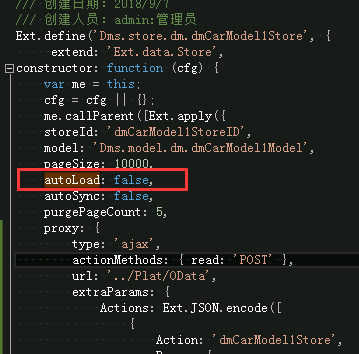
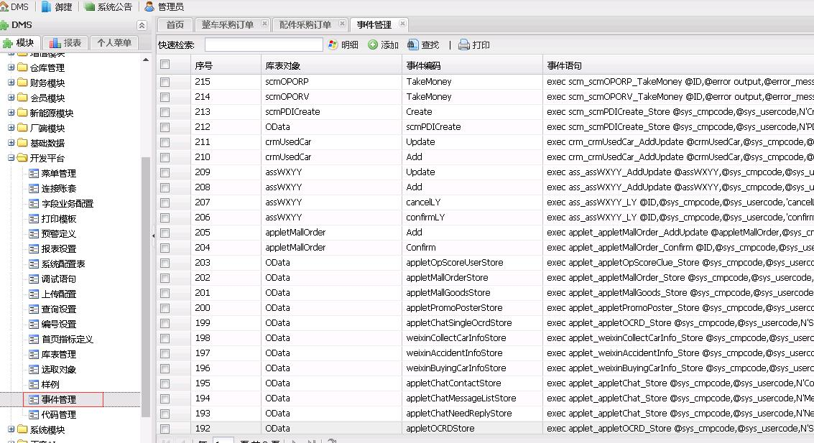
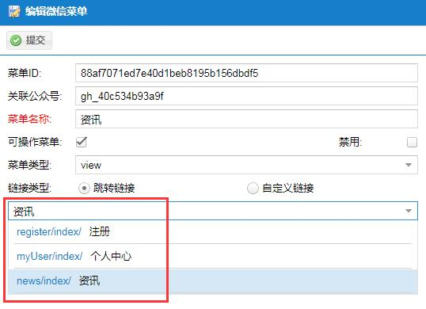

# 语法使用说明
## EXT4.2自定义组件配合SQLSercer使用说明
### querycombox
**演示图片**


**ext代码片段**
```
xtype: 'querycombox',
displayField: 'Name',
valueField: 'Code',
queryType: {
	scopeType: 'ass',
	docType: 'assYYXM',
	codeType: 'assYYXMItemCode',
}
```
**sqlserver代码片段演示**
>存储过程名称:sync_DynamicGrid_crm
```
/*
	维修预约
*/
ELSE IF @DocType='assYYXM' AND @CodeType IN ('assYYXMItemCode')
BEGIN
	--选择预约项目
	IF @CodeType='assYYXMItemCode'
	BEGIN
		--这个用于展示行
		IF @Action='StoreColume'
		BEGIN
			SELECT 'Code' [FieldCode],'编码' [FieldDesc],'nvarchar' [FieldType] 
			UNION ALL
			SELECT 'Name' [FieldCode],'名称' [FieldDesc],'nvarchar' [FieldType] 
		END
		--这个用于展示行里面的数据
		ELSE IF @Action='StoreContent'
		BEGIN
			SELECT T1.DocEntry [Code]
			,T1.Name
			FROM assYYXM T1
		END
	END
END
```
### OData (这个是用来数据自定义获取的)
采用OData进行资源获取的（这个是之前不懂，乱写的）
将全部通过sync_DynamicGrid,进行数据获取
```
CommonFunction.getComboPara(queryType)//方法
queryType: {
	scopeType: 'ass',//决定查找的存储过程的后缀名
	docType: 'assYYXM',
	codeType: 'assYYXMItemCode',
}
```
> 上面的那种说法是存在极大的问题的，其实上面的函数就是封装了一个下面的写法罢了

这种方式通常用在副表之中
附表中需要获取自定义数据时，可以采用下面这种方式
库表对象为OData
```
//所有车型
var j = Ext.JSON.encode([
	{
		Action: 'dmCarModel1Store',//这里对应的是事件编码
		Paras: {	//这里填写的就是添加的数据
			"CdnField": record.get('ID'),
			"QuickSearch": ''
		}
	}
]);
var dmCarModel1Store = Ext.getStore('dm.dmCarModel1Store');	//这里就是附表的store
dmCarModel1Store.getProxy().setExtraParam('Actions', j);
dmCarModel1Store.load({ params: { start: 0, limit: 10000 } })
```
> 这里的store需要说一下，如果使用了上面的那种方式来获取数据，
> store页面是无效的，所以我们编写store只是用来进行参数参考的
> 
> 我们可以看到store中autoload这个属性为false,为这个属性的srore都是不会调用的
> 因为srote是被动执行的，而附表常常是需要参数的，如主表的ID值，所以这个是需要使用上面的那种代码的而不是使用store

> 其实上面的那段代码就是重写了这个srote的页面替换了下面srote页面中的extraParams这个属性
```
Ext.define('Dms.store.dm.dmCarModel1Store', {
     extend: 'Ext.data.Store',
constructor: function (cfg) {
    var me = this;
    cfg = cfg || {};
    me.callParent([Ext.apply({
    storeId: 'dmCarModel1StoreID',
    model: 'Dms.model.dm.dmCarModel1Model',
    pageSize: 10000,
    autoLoad: false,							//我们看到这个属性为false，所以这个是不生效的
    autoSync: false,
    purgePageCount: 5,
    proxy: {
        type: 'ajax',
        actionMethods: { read: 'POST' },
        url: '../Plat/OData',
        extraParams: {
            Actions: Ext.JSON.encode([
                {
                    Action: 'dmCarModel1Store',
                    Paras: {
                        "CdnField": '0',
                        "QuickSearch": ''
                    }
                }
            ]),
            NeedTotal: false
        },
        reader: {
            type: 'json',
            root: 'dmCarModel1Store',
            successProperty: 'success'
        }
    },
     remoteSort: false
     }, cfg)]);
 }
});
```
### 添加一个自定义事件
```
	var para = {
		 Table: 'scmOPORP',			
		 Actions: Ext.JSON.encode({
			 "Key": '',
			 "SpAction": 'TakeMoney',				//这里对应的就是库表对象
			 "Actions": [
				 {
					 "Action": "TakeMoney",			//这里对应的就是事件编码编码
					 "Paras": {						//这里面的就是需要传入的值
						 "ID": 143
					 }
				 }
			 ]
		 })
	 };
	 //执行事件
	 devPlatFunction(devPlatObjConfig.action, para, function (result) {
		 if (result.success) {							//这里就是返回正确的时候的回调函数
			 Ext.getStore('crm.crmLockCarStore').reload();
			 //ExtjsHelper.alert.bottom('解锁完成', 's')
		 }
		 else {										//这里是出现错误的时候的回调函数   这里的错误信息是存储过程返回的
			 ExtjsHelper.alert.bottom(result.msg, 'e')
		 }
	 });
```
这种写法对应的需要添加一个事件

在开发平台->事件管理中
这里的事件语句就是，执行上面的自定义事件的时候，执行的sql语句
>  exec scm_scmOPORP_TakeMoney @ID,@error output,@error_message output
这其中  @error 和@error_message 是必须的，用来传递错误信息的

>对应的存储过程
```
ALTER proc [dbo].[scm_scmOPORP_TakeMoney](
	@ID INT
	,@error INT OUTPUT	--逻辑校验返回
	,@error_message NVARCHAR(255) OUTPUT
)
AS 
BEGIN
	SELECT @error = 1,@error_message = cast(@ID as varchar(50))+ '这个是测试内容'
	RETURN;

END
```
## 添加报表，单独一个列表
使用表单sync_DynamicReport系列
参考 
assWXGS assWXGSRepertoryButtonclick(索赔核价)
```
showSystemReport({
	reportType:'w',			//加这个属性表示以窗口模式打开
	scopeType: 'ass',
	docType: 'assWXFCID',
	codeType: 'assWXFCIDList',
	parentValue: ID,
	title: '库存清单清单'
})
```
## 特殊玩法
公告
dmNotice  
单独页面开发
# 后端开发框架观察笔录
## 前后端互联，并进行数据提取
将业务放置在SQLserver中的存储过程中，由前端决定进行的读写操作，后端只负责前端与SQLserver存储过程的连接
> 实例
1. GetTableList
	用于获取列表形式的数据
``` //所需要的参数
Table: dmBpCustomer    //表名
CdnField: 
Cdn: 
CdnValue: 
page: 1					//当前页数
start: 0				//开始位置	
limit: 25				//每页记录
```
2. OData
	用来进行动态资源获取的。这个可以在存储过程中来决定返回的数据展示内容
	也可以进行动态列的获取
```
queryType: {
	scopeType: 'ass',//决定查找的存储过程的后缀名
	docType: 'assYYXM',
	codeType: 'assYYXMItemCode',
}
```
## 鹏龙新项目微信
数据库：hc
项目在线地址：[微信会员平台](https://www.sap-unis.com/pc/Login/Home)
### 微信底端配置
 GetCodeNameList_wx
 
 跳转链接存储过程
 ### WeiXinMinProRegisterUser
 清除此表可以清除登陆状态
## 自我感想
1. 后台需要一个可以配置字段的地方，在不操作数据库的情况下，可以节省时间。
2. 相同性质点js框架，代码，可以在后台一键生成，通过代码编写
3. 关于子表，有时候会出现多个主表公用一个子表的方式，暂时想法是，不要有主表子表的概念，这样数据会冗杂


